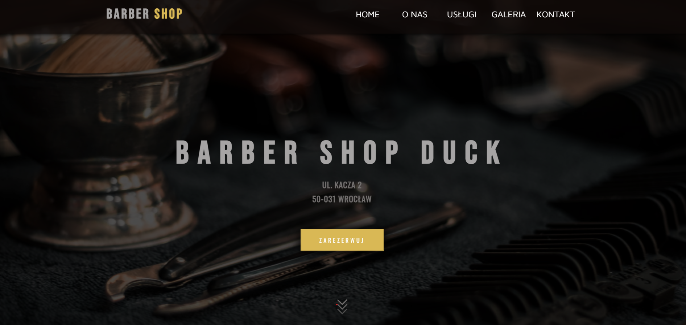
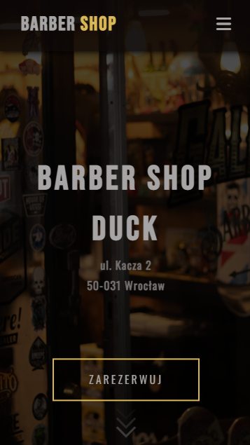

# The Barber Shop Duck - Landing Page

My first bigger project - A basic responsive landing page of a barber shop made with HTML, CSS and a little JS

## Screenshot

 

## Demo

- A live demo can be found here: (https://barber-shop-duck.vercel.app/)

## Built with

- HTML5
- CSS3/Flexbox/CSS grid/pseudo-elements
- Mobile First
- JS

## Useful resources

- [LIGHTBOX by Lokesh Dhakar](https://lokeshdhakar.com/projects/lightbox2) - Create a modal image gallery (lightbox) with CSS and JavaScript.
- [ScrollReveal](https://scrollrevealjs.org/guide/installation.html) -  JavaScript library for easily animating elements as they enter/leave the viewport.

## Photos
All images are from pexels.com and pixabay.com

